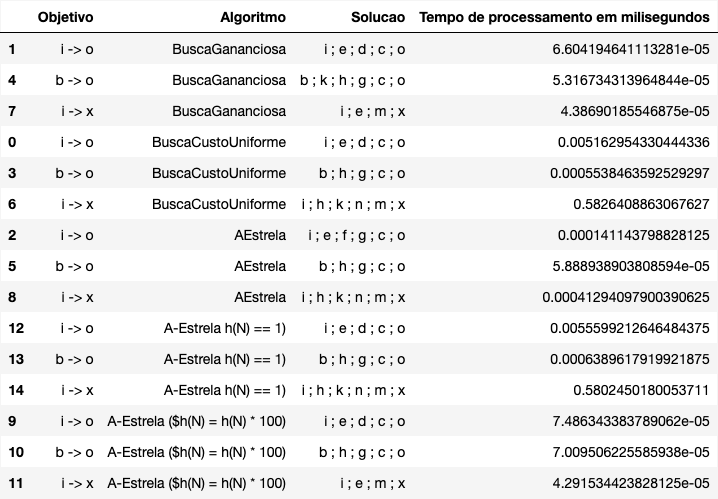

## Questões a serem respondidas:

### Tabela de resultados

-------------------------

### Qual foi o tempo de processamento até a implementação encontrar uma solução?
Os tempos de processamento foram listados na tabela acima.

### Por que o tempo de processamento foi diferente para cada algoritmo?
As diferenças no tempo de processamento são devidas ao comportamento inerente de cada algoritmo, que determina a ordem na qual os nós são expandidos e explorados. 

Vale ressaltar que a influência da heurística (e sua precisão/qualidade) desempenha um papel crucial na eficiência do algoritmo A-Estrela e suas variantes.

### Por que a solução encontrada foi diferente em cada algoritmo?

As soluções podem ser diferentes devido à maneira como cada algoritmo pondera o custo real versus a estimativa heurística para alcançar a meta. 

Algoritmos que dependem fortemente da heurística (como o Ganancioso e A-Estrela com heurística ampliada) são mais propensos a encontrar soluções subótimas em comparação com algoritmos que consideram mais o custo real (como o Custo Uniforme e A-Estrela com heurística admissível).

### Por que a solução encontrada foi diferente em cada versão do A-Estrela?
As diferentes soluções encontradas por cada versão do A-Estrela são o resultado direto de como a heurística é ponderada ou definida em relação ao custo real acumulado. 

Uma heurística fortemente ponderada pode inclinar a busca em direção a soluções mais rápidas, mas potencialmente subótimas, enquanto uma heurística subponderada ou constante pode resultar em uma busca mais uniforme e soluções mais ótimas, embora possa ser mais lenta.
