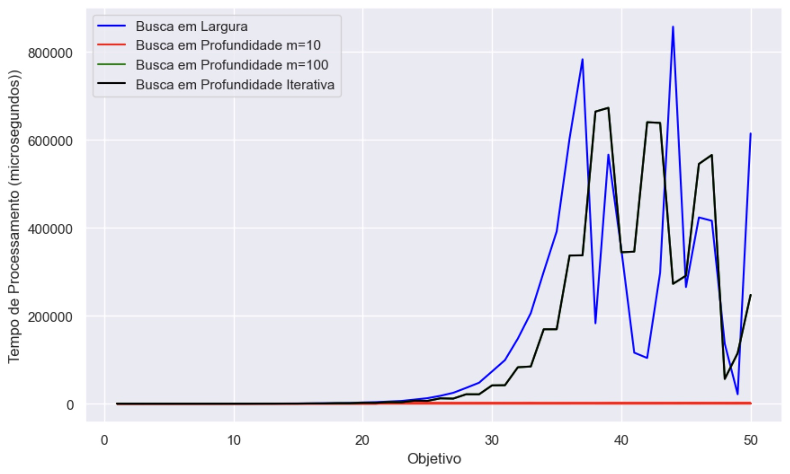

# Atividade de laboratório

#### Segundo o que discutimos em sala de aula, quais destes algoritmos são ótimos? Os resultado encontrados neste exercício são coerentes com está informação? Justifique a sua resposta.

Os algoritmos de busca em largura e busca em profundidade iterativa são ótimos, uma vez que esses nos garantem a solução dos problemas com menos iterações.

O algoritmo de  busca em profundidade, por outro lado, não nos garante esse tipo de solução, uma vez que ele pode demorar muito tempo para encontrar a solução do problema, sem contar que esse pode não encontrar a solução do problema, caso a  meta esteja em profundidade maior que m.

#### Segundo o que discutimos em sala de aula, quais destes algoritmos são completos? Os resultado encontrados neste exercício são coerentes com está informação? Justifique a sua resposta. 

Segundo o que discutimos em sala de aula, os algoritimos que são completos são:
- Busca em Largura
- Busca em Profundidade Iterativa

Uma vez que ambos garantem a solução do problema, caso exista uma solução.

#### Teve algum algoritmo que travou por falta de memória no seu computador? Se sim, qual é a explicação?

Não, não houve nenhum algoritimo que travou.

#### Qual é o algoritmo que tem um tempo de processamento menor? Justifique a sua resposta.

O algoritmo que tem um tempo de processamento menor é o algoritimo de busca em profundidade, pois dentro dos algoritmos que analisamos, ele é o que utilizou menor quantidade de  recursos computacionais. Conseguimos observar isso, pelo tempo que cada algoritmo levou.

Ou seja, ele foi o que levou menos tempo para encontrar a solução do problema, tendo em vista que foi definido um "m" de 10 e 100.

