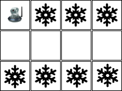
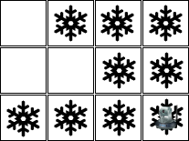
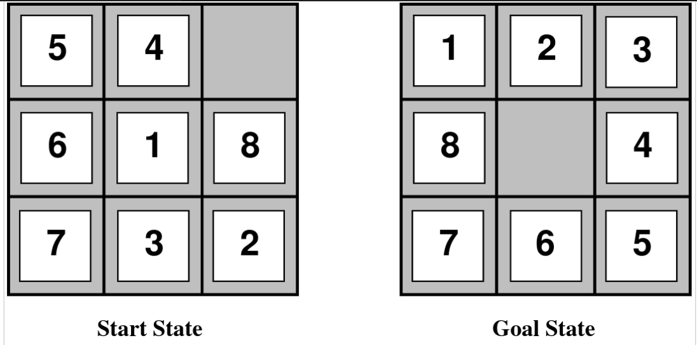

# Examples

These examples demonstrate how to model different search problems with AI Gym.

## Vacuum world

`VacuumWorldGeneric.py` receives a text file describing dirty rooms and the
robot's initial position. In the map, `0` means clean and `1` means dirty.

```text
0;1;1;1
0;0;0;0
1;1;1;1
```

Run the example with the configuration file, row, and column:

```bash
python docs/src/VacuumWorldGeneric.py configuration.txt 0 0
```

The available actions move left, right, up, or down, or clean the current
room. A valid solution reaches a state in which every room is clean.



Another configuration can start the robot on row 2, column 3:

```text
0;1;1;1
0;0;1;1
1;1;1;1
```

```bash
python docs/src/VacuumWorldGeneric.py configuration.txt 2 3
```



[View implementation](implementations/VacuumWorldGeneric.md)

## U2 bridge problem

The four members of U2 must cross a bridge in 17 minutes. It is night, they
have one flashlight, and no more than two people can cross together. Bono,
Edge, Adam, and Larry take 1, 2, 5, and 10 minutes respectively. A pair moves
at the slower person's speed.

The objective is to move everyone and the flashlight to the other side with
the lowest total cost.

[View implementation](implementations/U2.md)

## 8 Puzzle

The 8 Puzzle example uses A* to arrange numbered tiles into the target state.

{ width="400" }

[View implementation](implementations/Puzzle8.md)

## Noughts & Crosses

The Noughts & Crosses example models a complete 3×3 tic-tac-toe game for
`MinMax`. X is represented by `1` and maximizes utility; O is represented by
`-1` and minimizes it; empty squares use `0`.

Each state stores an immutable board and the next player. `successors()`
creates one state for every empty square. `cost()` returns a large terminal
utility for a win and a line-based estimate at the depth limit.

Run the example from the project root:

```bash
python -m docs.src.NoughtsNCrosses
```

To display the decision tree, change the final call to `play(trace=True)`.
MinMax displays two levels by default while preserving the complete selected
path. Increase `trace_max_depth` only for small game trees.

[View implementation](implementations/NoughtsNCrosses.md)
