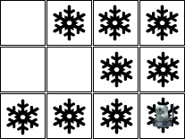

# Examples

Abaixo são descritos os problemas que podem ser resolvidos com esta biblioteca.

## Aspirador de Pó

O método `main` da classe `VacuumWorldGeneric.py` deve receber um arquivo texto que descreve a situação do ambiente e as posições do robô como parâmetros. Por exemplo, para o seguinte ambiente: 


O seguinte arquivo de configuração será entregue: 

```text
0;1;1;1
0;0;0;0
1;1;1;1
```

onde `0` significa **limpo** e `1` **sujo**.

E o seguinte comando deve ser executado:

```bash
python VacuumWorldGeneric.py configuracao.txt 0 0
``` 

As ações que o robô (agente) sabe executar são: 

* *esq*: ir para a esquerda;
* *dir*: ir para a direita;
* *baixo*: ir para baixo;
* *cima*: ir para cima;
* *limpar*: limpar o quarto onde está.

Ao executar o comando acima, o programa deverá gerar uma sequência de ações que fará com que o robô saia do **estado inicial** e chegue em um **estado final** válido. Um estado final válido é um estado onde todos os quartos (quadrados) estão limpos. 

Uma sequência de ações válidas para resolver o estado acima é: 

```
dir; limpar; dir; limpar; dir; baixo; baixo; limpar; esq; limpar; esq; limpar; esq; limpar
```

## Um outro exemplo 

Considere um novo exemplo:



Para este exemplo o arquivo de configuração precisa ter este conteúdo:

```text
0;1;1;1
0;0;1;1
1;1;1;1
```

E a chamada para o programa: 

```bash
python VacuumWorldGeneric.py configuracao.txt 2 3
```

O programa que está implementado em [VacuumWorldGeneric.py](src/VacuumWorldGeneric.py) não se preocupa com a validação dos dados de entrada. Assume-se que os dados de entrada estão corretos, por exemplo, a posição do robô é uma posição válida. 

A única tarefa que o programa deve fazer é se existir solução então retornar uma sequência de ações ótima para o problema. Se não existir solução então informar que não existe solução.

## Banda U2

A banda U2 tem um concerto que começa daqui a 17 minutos e
  todos precisam cruzar uma ponte par chegar lá. Todos os 4
  participantes estão do mesmo lado da ponte. É noite. Só
  há uma lanterna. A ponte suporta, no máximo, duas
  pessoas. Qualquer pessoa que passe, uma ou duas, deve passar com a
  lanterna na mão. A lanterna deve ser levada de um lado para outro
  e não ser jogada. Cada membro da banda tem um tempo diferente
  para passar de um lado para o outro. O par deve andar no tempo do
  menos veloz: Bono: 1 minuto para passar; Edge: 2 minutos para
  passar; Adam: 5 minutos para passar; e Larry: 10 minutos para
  passar.

O problema consiste em ter os quatro elementos da banda do outro lado
da ponte no menor tempo possível.

O arquivo [U2.py](src/U2.py) implementa uma solução possível para este problema. 

## 8 Puzzle

O arquivo [Puzzle8.py](src/Puzzle8.py) implementa um solucionador para o jogo Puzzle8:

<p align="center">

</p>